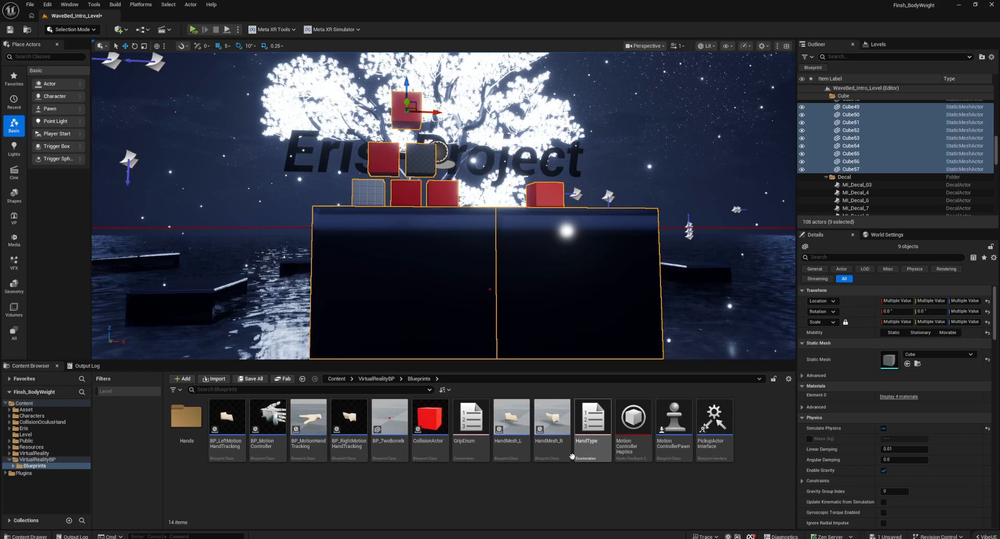
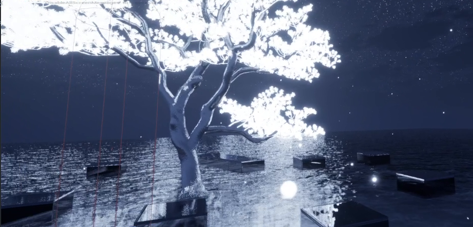
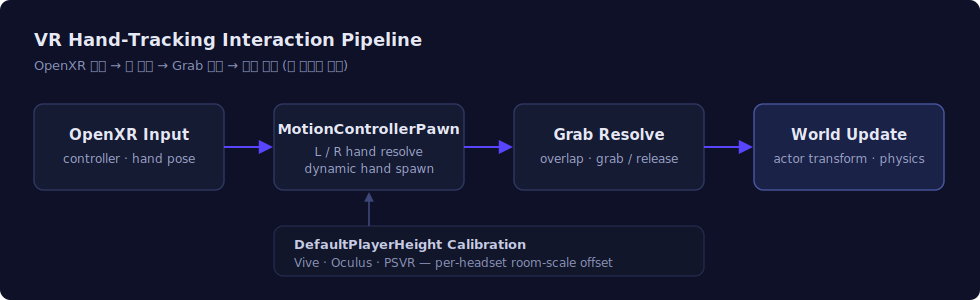

# Eris Project — VR Body-Tracking Experience

> Unreal Engine 5.7 · Meta Quest · OpenXR
> HMD 환경에서 실시간 풀바디·핸드 트래킹으로 오브젝트를 잡고 조작하는 룸스케일 VR 경험입니다.

## 프로젝트 개요

플레이어가 HMD를 착용하고 트래킹된 아바타로 가상 공간에 들어가, **맨손·모션 컨트롤러로 오브젝트를 잡고 조작**하는 룸스케일 VR 경험입니다. 달빛이 비치는 스타일라이즈드 물의 세계("Eris Project")를 무대로, **실시간 풀바디·핸드 트래킹**과 반사 수면·다이나믹 스카이를 구현했습니다.

## 기술 스택

- **엔진**: Unreal Engine 5.7 (Blueprint)
- **VR**: OpenXR, Meta Quest (Oculus), 룸스케일
- **트래킹**: 풀바디 + 핸드 트래킹, 모션 컨트롤러
- **입력**: Enhanced Input, 핸드·컨트롤러 Pawn
- **렌더링**: 실시간 반사 수면, 다이나믹 나이트 스카이, 스타일라이즈드 라이팅
- **UI**: UMG 커스텀 위젯

---

## 담당 구현

### 1. VR 인터랙션 Pawn (MotionControllerPawn)
- VR 오리진 → 카메라 리그 구성 및 룸스케일 트래킹
- 좌·우 컨트롤러 및 핸드 트래킹 해석, 동적 핸드 스폰
- Grab / Release 로직으로 오브젝트 잡기·놓기 처리
- 헤드셋별 **DefaultPlayerHeight** 보정 (Vive / Oculus / PSVR)

### 2. 핸드 트래킹 상호작용
- 맨손 제스처와 모션 컨트롤러 입력으로 오브젝트를 잡고 이동·조작
- 오버랩 판정 기반 Grab 대상 결정 및 트랜스폼 동기화

### 3. 실시간 환경 & 렌더링
- 반사 수면, 다이나믹 나이트 스카이, 발광 오브젝트로 몰입형 무대 구성
- 스타일라이즈드 라이팅으로 분위기 연출

### 4. UI 시스템
- UMG 기반 커스텀 위젯으로 인게임 인터랙션 UI 구성

---

## 개발 화면 (Unreal Editor)

**VR 씬 환경 — Eris Project**

**핸드 트래킹 인터랙션 (In-VR) — ①**

**핸드 트래킹 인터랙션 (In-VR) — ②**

**핸드 트래킹 인터랙션 (In-VR) — ③**

**VR 시스템 로직 — Blueprint (MotionControllerPawn)**

**월드 — 나이트 워터 환경**

## 기술 상세 — VR 핸드 트래킹 인터랙션 파이프라인

- **입력 수집**: OpenXR 컨트롤러 / 핸드 트래킹 포즈 취득
- **손 해석**: 좌·우 손 결정 및 동적 핸드 스폰
- **Grab 판정**: 오버랩 검사 → Grab / Release 상태 전환
- **월드 반영**: 잡은 액터의 트랜스폼·물리를 매 프레임 동기화
- **헤드셋 보정**: `DefaultPlayerHeight`로 Vive / Oculus / PSVR 룸스케일 오프셋 보정

전체 영상: [에디터 & VR 게임플레이](videos/editor-gameplay.mp4) · [블루프린트 시스템](videos/blueprint-systems.mp4)

---

*개인 포트폴리오 목적의 기술 설명 저장소입니다. 프로젝트 소스 코드는 포함하지 않습니다.*
