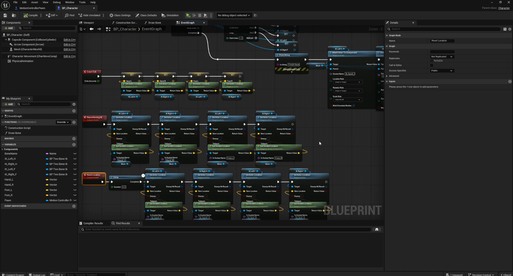

<!-- Portfolio showcase — media only. Source code is not included in this repository. -->

<h1 align="center">Eris Project — VR Body-Tracking Experience</h1>

<b>Room-scale VR built in Unreal Engine 5.7 with real-time full-body & hand tracking.</b> 
UE 5.7 기반 룸스케일 VR · 실시간 풀바디·핸드 트래킹 · OpenXR / Meta Quest

  
  
  
  
  
  

  
   <em>Real-time hand tracking — bare-hand grab interaction in room-scale VR</em>

---

## ⭐ Highlights

- 🕹️ **Real-time hand & body tracking** — bare-hand gestures and motion controllers drive
  natural interaction (grab, throw, manipulate) on Meta Quest via OpenXR.
- 🌌 **Atmospheric real-time world** — reflective water, dynamic night sky, and volumetric
  lighting create a striking, immersive stage.
- 🧩 **Blueprint-engineered VR systems** — motion-controller pawn, hand-tracking, grab
  mechanics, and cross-platform player-height calibration (Vive / Oculus / PSVR).
- ⚙️ **Built a C++ MCP plugin from source** — compiled and integrated the community
  **VibeUE** MCP server for an AI-in-the-editor development workflow (UE 5.7 has no
  official MCP).

핸드·바디 트래킹 · 실시간 몰입형 월드 · 블루프린트 VR 시스템 · C++ MCP 플러그인 소스 빌드/통합

---

## 🛠️ Tech Stack

| Area | Details |
|---|---|
| **Engine** | Unreal Engine 5.7.4 |
| **XR** | OpenXR · Meta Quest (Oculus) · room-scale |
| **Tracking** | Full-body + hand tracking, motion controllers |
| **Scripting** | Blueprints (visual scripting) · C++ (plugin build) |
| **Input** | Enhanced Input, hand-tracking & motion-controller pawns |
| **Rendering** | Real-time reflective water, dynamic sky, stylized lighting |
| **Tooling** | AI-assisted authoring via **VibeUE MCP** (`:8088`) |

---

## 🧠 Engineering — Under the Hood

VR interaction is driven by a **MotionControllerPawn** Blueprint: a `VROrigin → Camera`
rig, per-hand controller & hand-tracking resolution, dynamic hand spawning, grab/release
logic, and a `DefaultPlayerHeight` calibration path for different headsets.

VR 상호작용은 **MotionControllerPawn** 블루프린트로 구동됩니다 — VR 오리진/카메라 리그, 좌·우 컨트롤러
및 핸드 트래킹 처리, 동적 핸드 스폰, Grab/Release 로직, 헤드셋별 플레이어 높이 보정을 포함합니다.

  
   <em>MotionControllerPawn EventGraph — hand-tracking & grab systems in Blueprints</em>

---

## 🌌 The World

  
  

A moonlit water world — a luminous centerpiece tree, drifting platforms, and mirror-still
water, all rendered in real time for VR (달빛의 물의 세계 · 발광 오브젝트 · 실시간 반사).

---

## 🤖 AI-Assisted Development

Unreal Engine 5.7 ships **no official MCP server**, so I compiled the community **VibeUE**
plugin from source (the `5-7` branch) and connected it to an AI client over MCP
(`http://127.0.0.1:8088/mcp`). This enabled blueprint / asset / level authoring — and
in-viewport screenshot review — directly from natural-language prompts.

UE 5.7엔 공식 MCP가 없어, 커뮤니티 플러그인 **VibeUE**를 소스 빌드(`5-7` 브랜치)해 MCP로 AI 클라이언트와
연결했습니다. 블루프린트·에셋·레벨 작업과 뷰포트 스크린샷 검증을 자연어 지시로 수행하는 워크플로우입니다.

  
   <em>▶ UE 5.7 editor with VibeUE MCP connected — click to watch</em>

---

## 🎬 Demo Videos

| | |
|:--:|:--:|
|  |  |
| **Editor & MCP workflow** — scene building + hand-tracking gameplay | **Blueprint systems** — VR pawn & hand-tracking graphs |

Click a thumbnail to play the full video on GitHub.

---

## 👤 My Role

Solo developer — designed and built the experience end to end:

- **VR/XR development** — OpenXR setup, Meta Quest hand & body tracking, room-scale pawn.
- **Blueprint systems** — motion-controller pawn, grab mechanics, cross-headset calibration.
- **Real-time art & lighting** — reflective water, dynamic sky, stylized night mood.
- **Tooling & pipeline** — built a C++ UE plugin from source and integrated an AI/MCP
  authoring workflow to accelerate iteration.

1인 개발 · VR/XR · 블루프린트 시스템 · 실시간 아트/라이팅 · C++ 플러그인 빌드 및 AI 파이프라인 통합

---

## 📌 Notes

- This repository is a **portfolio showcase** — media and results only.
  **Project source code is not included.** (본 저장소는 포트폴리오 쇼케이스이며 프로젝트 소스는 비공개입니다.)
- Captured on Unreal Engine 5.7.4, OpenXR (Oculus) runtime.

---

© 2026 immigration2000 · Built with Unreal Engine 5.7

