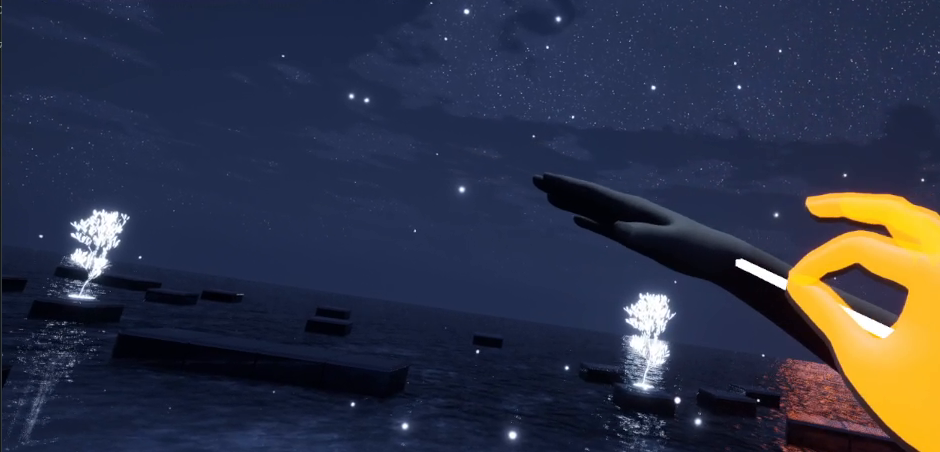
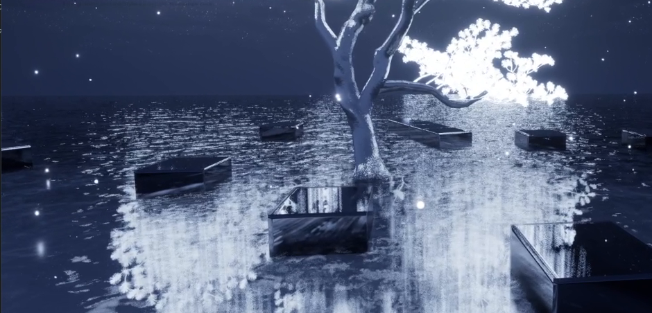
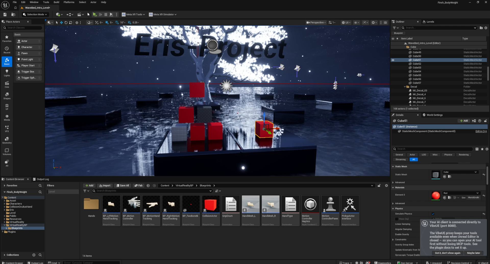

<!-- Portfolio showcase — media only. Source code is not included in this repository. -->

# Eris Project — VR Body-Tracking Experience (Unreal Engine 5.7)

> A stylized, immersive VR experience built in **Unreal Engine 5.7** with real-time
> **full-body and hand tracking** over OpenXR / Meta Quest — set in a moonlit,
> reflective "night-water world."
>
> UE 5.7 기반의 몰입형 VR 경험 프로젝트. OpenXR / Meta Quest 상에서 **실시간 풀바디·핸드 트래킹**을
> 지원하며, 달빛이 비치는 물의 세계를 무대로 합니다.

  

---

## ✨ Overview / 개요

**Eris Project** is a virtual-reality sandbox where the player inhabits a tracked avatar
and interacts with a dreamlike environment — a glowing tree, still black water, drifting
platforms, and points of light — entirely in room-scale VR.

플레이어는 트래킹된 아바타로 가상 공간에 들어가, 빛나는 나무·잔잔한 수면·떠다니는 플랫폼으로 이루어진
초현실적 환경을 룸스케일 VR로 탐험합니다.

| | |
|---|---|
| **Engine / 엔진** | Unreal Engine 5.7 |
| **XR Runtime** | OpenXR · Meta Quest (Oculus) |
| **Tracking / 트래킹** | Full-body + hand tracking, motion controllers |
| **Rendering** | Real-time reflective water, dynamic sky, stylized lighting |
| **Interaction** | Enhanced Input, motion-controller & hand-tracking blueprints |
| **Tooling / 개발도구** | AI-assisted authoring via **VibeUE MCP** (see below) |

---

## 🎮 In-Experience / 인게임

  
  

- **Hand tracking** — bare-hand gestures and motion-controller input drive interaction
  (핸드 트래킹 및 모션 컨트롤러 입력 기반 상호작용).
- **Atmospheric world** — real-time water reflections, a dynamic night sky, and a
  luminous centerpiece tree create the mood (실시간 물 반사 · 다이나믹 하늘 · 발광 오브젝트).
- **Room-scale immersion** — designed for standing / room-scale play on Meta Quest.

---

## 🤖 AI-Assisted Development / AI 기반 개발 워크플로우

This project was built with an **AI-in-the-editor** workflow. Unreal Engine 5.7 has no
official MCP server, so the community **VibeUE** plugin was compiled from source and
connected to an AI client over MCP (`http://127.0.0.1:8088/mcp`) — enabling blueprint,
asset, and level authoring, plus in-viewport screenshots for visual self-review, directly
from natural-language prompts.

UE 5.7에는 공식 MCP가 없어, 커뮤니티 플러그인 **VibeUE**를 소스 빌드해 MCP로 AI 클라이언트와 연결했습니다.
블루프린트·에셋·레벨 작업과 뷰포트 스크린샷 검증을 자연어 지시로 수행하는 워크플로우입니다.

  
   
  <em>▶ Click to watch the editor + MCP workflow video / 에디터·MCP 워크플로우 영상 (클릭)</em>

**Stack:** UE 5.7 · VibeUE (community MCP server, built from the `5-7` branch) ·
OpenXR · Meta Quest.

---

## 📌 Notes / 참고

- This repository is a **portfolio showcase** — it contains media and results only.
  **Project source code is not included.**
  본 저장소는 **포트폴리오 쇼케이스**로, 미디어·결과물만 포함합니다. **프로젝트 소스는 비공개입니다.**
- Captured on Unreal Engine 5.7.4, OpenXR (Oculus) runtime.

---

© 2026 immigration2000 · Built with Unreal Engine 5.7
